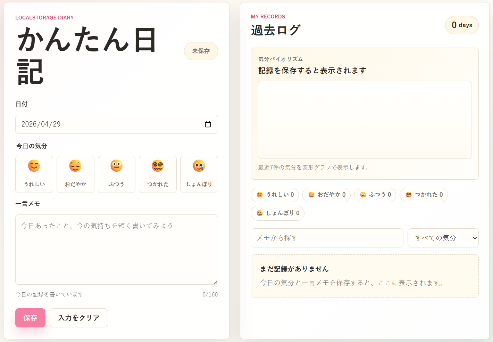

# 学習ログ

HTML/CSS/JavaScriptとlocalStorageだけで動く、小さな学習ログアプリです。

日付ごとに「今日の調子」と「今日の学習メモ」を保存できます。保存した記録はブラウザのlocalStorageに残るため、ページを閉じても同じブラウザで再度開けば学習記録を見返せます。

## 📱 デモ

🔗 [https://gigaschool.github.io/tiny-diary/](https://gigaschool.github.io/tiny-diary/)



## デモの動かし方

`index.html` をブラウザで開くだけで使えます。ビルドやサーバー起動は不要です。

```text
tiny-diary/
├── index.html
├── styles.css
├── app.js
├── README.md
└── LICENSE
```

## 機能

- 今日の日付を自動セット
- 学習の調子を5種類から選択
- 今日の学習メモを保存
- 日付ごとに1件の記録として保存
- 同じ日付で保存すると上書き
- 学習記録の一覧表示
- 保存済みログの編集
- 保存済みログの削除
- 学習メモ検索
- 調子フィルター
- 最近7件の集中度の流れを表示するグラフ

## 使用技術

- HTML
- CSS
- JavaScript
- localStorage

外部ライブラリは使っていません。

## localStorage

保存キーは `study-log.entries.v1` です。

旧版の `tiny-diary.entries.v1` が残っている場合は、そのデータも読み込めます。

データは次のような配列で保存されます。

```json
[
  {
    "id": "example-id",
    "date": "2026-04-29",
    "mood": "happy",
    "note": "数学の復習を30分。英単語を20語確認した。",
    "createdAt": "2026-04-29T10:00:00.000Z",
    "updatedAt": "2026-04-29T10:00:00.000Z"
  }
]
```

## 調子データ

調子は次の5種類です。

| 値 | 表示 | スコア |
| --- | --- | --- |
| `happy` | とても集中 | 5 |
| `calm` | 順調 | 4 |
| `normal` | ふつう | 3 |
| `tired` | 少し疲れた | 2 |
| `sad` | 切り替えたい | 1 |

集中度の推移では、最近7件の記録をこのスコアに変換して、SVGグラフとして表示します。

## 教材で説明しやすい流れ

1. フォームから値を受け取る
2. JavaScriptの配列に学習ログデータを追加する
3. `JSON.stringify` でlocalStorageへ保存する
4. `JSON.parse` でlocalStorageから読み込む
5. 配列をもとに一覧と集中度グラフを再描画する

## ファイル構成

- `index.html`: 画面の構造
- `styles.css`: レイアウトと見た目
- `app.js`: 保存、表示、編集、削除、検索、集中度グラフ描画
- `README.md`: この説明ファイル
- `LICENSE`: MITライセンス

## アプリの構成（初心者向け解説）

このアプリは **3つのファイル** だけで動いています。それぞれの役割を「家」に例えると次のとおりです。

| ファイル | 役割 | 家で例えると |
| --- | --- | --- |
| `index.html` | 画面に表示する部品を並べる | 間取り・柱・壁 |
| `styles.css` | 見た目・色・レイアウトを整える | 内装・壁紙・家具の配置 |
| `app.js` | ボタンを押したときの動きを制御する | 電気・水道・スイッチの仕組み |

### 3つのファイルのつながり

```
index.html（骨組み）
  ↓ CSS を読み込む → styles.css が色・形を付ける
  ↓ JS  を読み込む → app.js  が動きを与える
```

`index.html` が起点で、`<link>` タグで CSS を、`<script>` タグで JS を読み込んでいます。

### データの流れ

学習記録を「保存」したときに何が起きているか、順番に追うと次のとおりです。

```
① ユーザーが日付・調子・学習メモを入力して「記録を保存」ボタンを押す
         ↓
② app.js が入力値を受け取り、記録オブジェクトを作る
   { date: "2026-05-10", mood: "happy", note: "読書メモを2行、数学の問題を3問解いた" }
         ↓
③ entries 配列に追加して localStorage へ保存
   （ブラウザを閉じてもデータが消えない）
         ↓
④ render() 関数が呼ばれ、画面全体を再描画する
   ├─ 集中度グラフを更新
   ├─ 調子ごとの集計を更新
   └─ 記録の一覧を更新
         ↓
⑤ styles.css が当たって、見やすいカード形式で表示される
```

### 画面レイアウト

```
┌──────────────────────┬───────────────────────────────┐
│   左パネル（入力）    │   右パネル（学習記録）         │
│                      │                               │
│  日付: [__________]  │  📈 集中度の推移グラフ         │
│  調子: 🎯📘🙂☕🌙   │                               │
│  学習メモ: [______]  │  🎯 12件 📘 8件 🙂 5件 ...   │
│  [保存] [リセット]   │                               │
│                      │  🔍 検索 [___]  絞込 [___]    │
│                      │                               │
│                      │  ┌─── 記録カード ──────────┐  │
│                      │  │ 2026/05/10（日）         │  │
│                      │  │ 🎯 とても集中            │  │
│                      │  │ 英単語を20語復習した      │  │
│                      │  │ [編集] [削除]             │  │
│                      │  └──────────────────────────┘  │
└──────────────────────┴───────────────────────────────┘
```

### JavaScript の主な関数

| 関数名 | 何をするか |
| --- | --- |
| `loadEntries()` | ページを開いたとき、localStorageから記録を読み込む |
| `saveEntries()` | entries 配列を localStorage に書き込む |
| `render()` | グラフ・集計・一覧を全て再描画する |
| `getFilteredEntries()` | 検索・調子フィルターで絞り込んだ記録を返す |
| `escapeHtml()` | ユーザー入力を安全に表示する（セキュリティ対策） |

## ライセンス

MIT License
